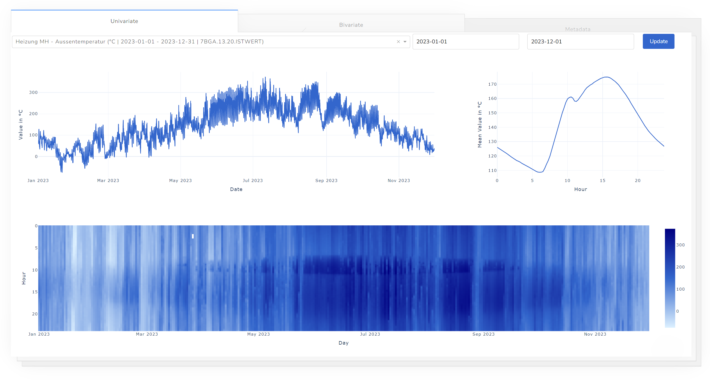

# fhnw-ds-ivi

Dashboard implementation for the Interactive Visualization (ivi) course at FHNW.

## Rotating Gif

This is a rotating Gif from my bachelor thesis as mentioned in the report:


## Dashboard

To use the dashboard, you need to contact me for the database access, as it is not public. This is what the dashboard looks like:



## Install Repository Dependencies

``` bash
pip install poetry
```

``` bash
poetry lock --no-update
```

``` bash
poetry install --no-root
```

``` bash
poetry shell
```

To get the current environment name use:

``` bash
poetry env info -p
```

Install packages to environment:

``` bash
poetry add numpy
```
